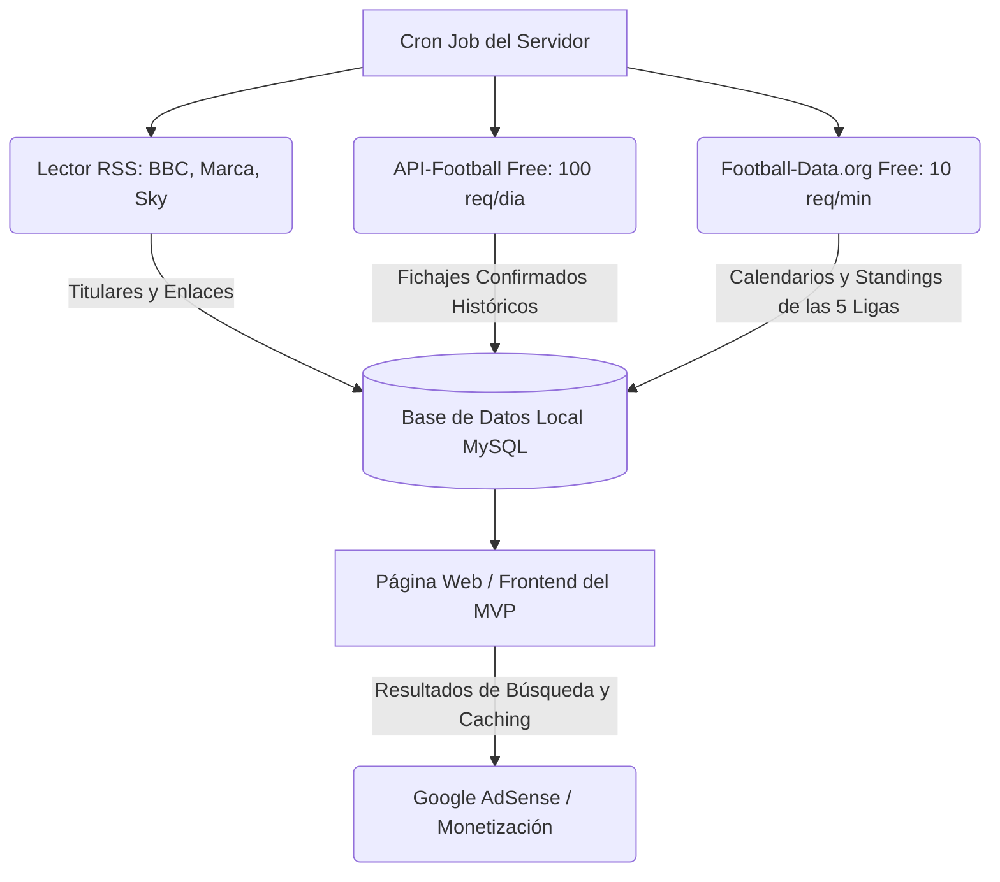

# Investigación de APIs y Fuentes de Datos de Fútbol: Fichajes, Rumores y las 5 Grandes Ligas para el MVP

Este documento presenta una investigación detallada de las opciones de APIs y fuentes de datos disponibles para obtener información sobre las **5 grandes ligas europeas** (Premier League, La Liga, Serie A, Bundesliga y Ligue 1), enfocándose en **fichajes confirmados** y **rumores de traspasos**, priorizando opciones **gratuitas o de bajo costo** para el desarrollo y lanzamiento de un Producto Mínimo Viable (MVP).

---

## 1. Tabla Comparativa de Opciones

| Proveedor / Fuente | Tipo de Datos | Cobertura de Ligas | Límite del Plan Gratuito | Costo Inicial de Pago | Idoneidad para MVP |
| :--- | :--- | :--- | :--- | :--- | :--- |
| **[API-Football (API-Sports)](https://www.api-football.com/)** | Estadísticas, Fixtures, Fichajes | Excelentes (1200+ ligas) | 100 peticiones / día | Desde $19 USD/mes (7,500 req/día) | **Alta** (para datos de jugadores y fichajes oficiales) |
| **[Football-Data.org](https://www.football-data.org/)** | Fixtures, Clasificaciones, Equipos | Grandes Ligas en plan gratuito | 10 peticiones / minuto | Desde €15 EUR/mes | **Alta** (para tablas de posición, resultados y calendarios) |
| **[Sportmonks](https://sportmonks.com/)** | Estadísticas, Rumores de Fichajes | Ligas secundarias en gratis | Restringido a ligas menores | Desde €29 EUR/mes + €99/mes por Rumores | **Baja** (demasiado costoso para un MVP sin presupuesto) |
| **Feeds RSS de Medios (BBC, Sky, Marca)** | Rumores de fichajes (Textual) | Global / 5 grandes ligas | **100% Gratis sin límites** | N/A | **Excelente** (la mejor opción sin costo para rumores y noticias) |
| **Scrapers Unoficiales (Transfermarkt)** | Fichajes, Valores de Mercado | Global (Transfermarkt) | **100% Gratis** (Auto-alojado) | N/A (Costo de servidor propio) | **Media-Alta** (requiere mantenimiento técnico pero da datos premium gratis) |

---

## 2. Análisis Detallado de Alternativas

### A. API-Football (El estándar para Datos de Fútbol y Fichajes)
Es la API más popular entre desarrolladores de apps deportivas por su facilidad de uso y la cantidad de datos que ofrece en una sola suscripción.

*   **¿Qué ofrece gratis?:**
    *   Acceso completo a todos los endpoints incluyendo la sección `/transfers`.
    *   100 peticiones al día (ideal para desarrollo y pruebas).
*   **Endpoint de Fichajes (`/transfers`):**
    *   Permite consultar fichajes confirmados filtrando por `player` (ID del jugador) o `team` (ID del equipo).
    *   Devuelve la fecha del traspaso, el equipo de origen (`out`), el de destino (`in`), el tipo de transferencia (compra, préstamo, libre) y el jugador involucrado.
*   **Precios:**
    *   **Free:** 100 req/día ($0 USD)
    *   **Pro:** 7,500 req/día ($19 USD/mes)
    *   **Mega:** 75,000 req/día ($39 USD/mes)
*   **Estrategia para el MVP:** Utilizar el plan gratuito para renderizar fichajes confirmados históricos y de la temporada actual. Para no agotar las 100 peticiones diarias en producción, **se debe implementar un sistema de caché agresivo** en la base de datos local (por ejemplo, guardar el historial de transferencias de los jugadores y actualizarlo solo una vez al día).

---

### B. Football-Data.org (Ideal para Calendarios, Posiciones y Resultados)
Si tu sitio web requiere mostrar las tablas de posiciones (standings) y los resultados en directo de las 5 grandes ligas, esta es la mejor opción sin costo.

*   **¿Qué ofrece gratis?:**
    *   Acceso ilimitado en tiempo para 12 competiciones principales, incluyendo la Champions League, Premier League, La Liga, Serie A, Bundesliga y Ligue 1.
    *   Límite de **10 peticiones por minuto**.
*   **Limitaciones:**
    *   No contiene un endpoint específico de rumores o fichajes detallados.
    *   El plan gratuito no incluye estadísticas detalladas de jugadores ni alineaciones en tiempo real.
*   **Precios:**
    *   **Free:** 10 req/min ($0 EUR)
    *   **Paid Tiers:** Desde €15 EUR/mes para aumentar el límite a 20 req/min y añadir datos históricos.
*   **Estrategia para el MVP:** Utilizar esta API de forma gratuita exclusivamente para alimentar las páginas de clasificaciones y los partidos/calendarios de las 5 grandes ligas, ahorrando las llamadas de API-Football para datos de jugadores o fichajes.

---

### C. Sportmonks (API de Rumores de Fichajes)
Sportmonks es una de las poquísimas APIs profesionales que ofrece un endpoint específico estructurado de **Rumores de Fichajes (Transfer Rumours)**.

*   **El Endpoint de Rumores:**
    *   Proporciona el nombre del jugador, el club actual, los clubes interesados, el porcentaje de probabilidad del rumor (Bajo/Medio/Alto), la fuente del rumor (por ejemplo, "Sky Sports", "Marca") y el enlace a la noticia original.
*   **Limitaciones y Precios:**
    *   El plan gratuito **no incluye** las 5 grandes ligas europeas (está limitado a ligas pequeñas como Escocia o Dinamarca).
    *   Para acceder a las 5 grandes ligas necesitas un plan de pago (desde €29 EUR/mes).
    *   El módulo de *Transfer Rumours* se cobra como un **Add-on** adicional con un costo de **€99 EUR/mes**.
*   **Estrategia para el MVP:** Debido a su alto costo (€128+ EUR/mes en total), **no se recomienda** para el lanzamiento inicial. Es una excelente opción para migrar una vez que el sitio web esté monetizado y genere ingresos recurrentes por publicidad.

---

### D. Feeds RSS y Agregadores de Noticias (La mejor opción gratuita para Rumores)
Dado que los rumores de fichajes no son estadísticas oficiales sino noticias periodísticas, la forma más inteligente y 100% gratuita de obtenerlos en tiempo real es a través del parseo de feeds RSS de los principales medios deportivos.

*   **Fuentes Clave con Feeds RSS Gratuitos:**
    *   **BBC Sport (Fútbol):** `https://feeds.bbci.co.uk/sport/football/rss.xml` (Excelente sección de rumores diarios del fútbol inglés).
    *   **Marca (Fichajes):** Se puede estructurar un parser para su feed de fútbol o usar herramientas gratuitas de RSS a partir de su sección de fichajes (`https://www.marca.com/futbol/mercado-fichajes.html`).
    *   **Sky Sports Transfer Centre:** Generar un feed dinámico usando herramientas como [RSS.app](https://rss.app/) o parseando la estructura HTML de la página web de Sky.
*   **Ventajas:**
    *   Completamente gratuito y sin límites de peticiones.
    *   Contenido en tiempo real redactado por periodistas profesionales.
    *   Excelente para SEO y generación de contenido dinámico en tu web.
*   **Estrategia para el MVP:** Crear un script PHP en el servidor que corra en segundo plano (vía Cron Job) cada 1 o 2 horas. Este script lee los feeds RSS, extrae los titulares y fragmentos que contengan palabras clave de fichajes (ej. "fichaje", "traspaso", "rumor", "firmar", "interesa") y los guarda en la base de datos local asociados con etiquetas de la liga o equipo correspondiente.

---

### E. Scrapers de Transfermarkt en GitHub (Datos Premium Auto-Alojados)
Transfermarkt es la base de datos de referencia mundial para valores de mercado, fichajes y rumores. No tienen una API pública oficial, pero la comunidad ha desarrollado scrapers de código abierto muy eficientes.

*   **Proyectos Recomendados en GitHub:**
    *   **[felipeall/transfermarkt-api](https://github.com/felipeall/transfermarkt-api):** Un contenedor de Docker listo para usar que expone una API REST para obtener datos de Transfermarkt en formato JSON (equipos, jugadores, fichajes y valores de mercado).
    *   **[alexgasconn/transfermarkt-scraper-api](https://github.com/alexgasconn/transfermarkt-scraper-api):** Pipeline en Python con FastAPI y SQLite que extrae y sirve los datos.
*   **Ventajas:** Acceso a la base de datos de fichajes más grande del mundo sin pagar licencias costosas.
*   **Desventajas/Riesgos:**
    *   **Legal/Términos de Uso:** Transfermarkt prohíbe el scraping comercial en sus términos y condiciones. Si detectan un volumen muy alto de peticiones desde tu IP de producción, podrían bloquearla.
    *   **Mantenimiento:** Si Transfermarkt rediseña su web, el scraper se romperá y tendrás que actualizar el código de los selectores HTML.
*   **Estrategia para el MVP:** Puedes desplegar `transfermarkt-api` en tu propio servidor local o en un VPS barato (ej. Hetzner o DigitalOcean de $4/mes). Para mitigar el riesgo de bloqueo, configura el scraper para que funcione por la noche, use proxies rotativos o simplemente realice peticiones muy espaciadas en el tiempo guardando todo localmente en tu base de datos MySQL/SQLite.

---

## 3. Arquitectura Recomendada para el MVP (Costo $0/mes)

Para lograr un producto robusto con las 5 grandes ligas, fichajes y rumores sin gastar dinero en APIs antes de monetizar, se propone la siguiente arquitectura híbrida:

### Reglas de Sincronización y Caché en el MVP:
1.  **Tablas de Posiciones y Calendarios:** Actualizar una vez al día desde `Football-Data.org` y guardarlos en una tabla caché en MySQL. Tus usuarios consultarán tu base de datos, no la API directamente, evitando límites de peticiones.
2.  **Fichajes Oficiales:** Usar `API-Football` para sincronizar los fichajes de los equipos de las 5 grandes ligas una vez a la semana durante la temporada baja, y una vez al día durante los mercados de transferencias (Enero y Julio/Agosto). Guardar todo en una tabla local `fichajes`.
3.  **Rumores Diarios:** Configurar el script de PHP para parsear los feeds RSS de noticias cada 3 horas. De esta manera, el feed de rumores de tu MVP se actualizará constantemente de forma 100% gratuita y totalmente legal (siempre que pongas un enlace atribuyendo la noticia a la fuente original, ej: *"Vía Marca"*, lo cual además te protege legalmente).

---

## 4. Aspectos Legales y de Monetización para el MVP

Si planeas colocar anuncios (Google AdSense, Media.net, etc.) para monetizar el sitio web:
1.  **Contenido Copiado vs. Agregado:** Google AdSense rechaza sitios con "contenido de poco valor" o meramente copiado de otros lados. Si usas feeds RSS, no copies el artículo completo. Muestra solo un título atractivo, un breve resumen de 2-3 líneas redactado por ti (o generado con IA con un toque único), y el enlace a la fuente original.
2.  **Derechos de Autor de Datos Deportivos:** Las clasificaciones, fixtures y resultados de partidos son hechos públicos no protegibles por derechos de autor en la mayoría de jurisdicciones. Sin embargo, el uso de logos oficiales de las ligas (ej. logo de la Premier League) o de los clubes puede estar sujeto a copyright. Se recomienda usar nombres textuales o imágenes genéricas libres de derechos para el MVP si quieres evitar problemas con marcas registradas al aplicar a redes publicitarias.
